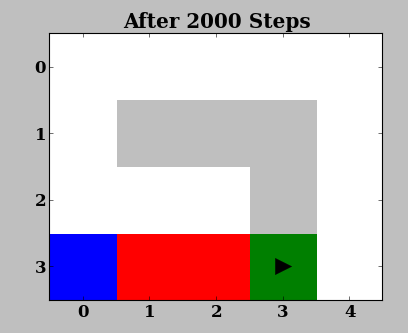
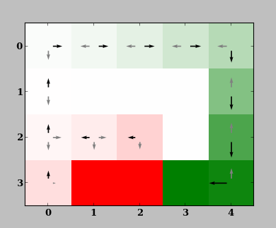
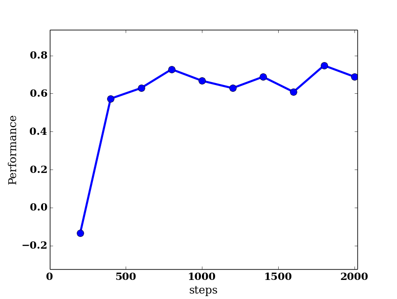
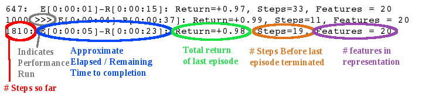
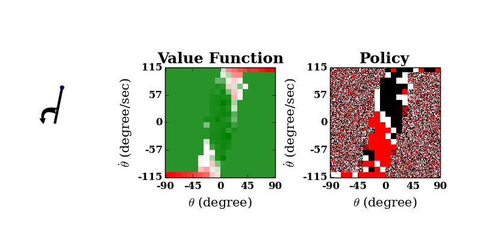
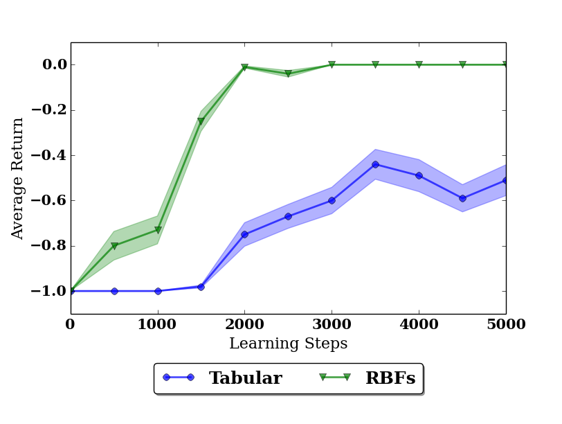

.. _tutorial:

Getting Started
===============

This tutorial covers the most common type of experiment in reinforcement
learning: the control experiment. An agent is supposed to find a good policy
while interacting with the domain. 

.. note::

    If you don't use the developer verion of rlpy but installed the toolbox via pip
    you can get the example scripts referenced in this tutorial as follows:
    Download the latest RLPy package from https://pypi.python.org/pypi/rlpy and extract
    the `examples` folder from the archive. In this folder you find several examples
    of how to use RLPy.

First Run
---------

Begin by looking at the file `examples/tutorial/gridworld.py`:

.. literalinclude:: ../examples/tutorial/gridworld.py
   :language: python
   :linenos:
   
The file is an example for a reinforcement learning experiment. The main
components of such an experiment are the **domain**, `GridWorld` in this case,
the **agent** (`Q_Learning`), which uses the **policy** `eGreedy` and the
value function **representation** `Tabular`. The **experiment** `Experiment` is
in charge of the execution of the experiment by handling the interaction
between the agent and the domain as well as storing the results on disk (see
also :ref:`overview`).

The function `make_experiment` gets an id, which specifies the random seeds 
and a path where the results are stored. It returns an instance of an
`Experiment` which is ready to run. In line 53, such an experiment is created
and then executed in line 54 by calling its `run` method. The three parameters
of `run` control the graphical output. The result are plotted in line 57 and
subsequently stored in line 58.

You can run the file by executing it with the ipython shell from the rlpy
root directory::

    ipython examples/tutorial/gridworld.py

.. tip::
    We recommend using the IPython shell. Compared to the standard
    interpreter it provides color output and better help functions. It is more 
    comportable to work with in general. See the `Ipython homepage`_ for
    details. 
    
.. note::
    If you want to use the standard python shell make sure the rlpy root
    directory is in the python seach path for modules. You can for example
    use::

        PYTHONPATH=. python examples/tutorial/gridworld.py

.. tip::    
    You can also use the IPython shell interactively and then run the script
    from within the shell. To do this, first start  the interactive python shell 
    with::
        
        ipython

    and then inside the ipython shell execute::

        %run examples/tutorial/gridworld.py

    This will not terminate the interpreter after running the file and allows
    you to inspect the objects interactively afterwards (you can exit the shell
    with CTRL + D).

.. _Ipython homepage: http://ipython.org

What Happens During a Control Experiment
-----------------------------------------

During an experiment, the agent performs a series of episodes, each of which
consists of a series of steps.  Over the course of its lifetime, the agent
performs a total of `max_steps` learning steps, each of which consists of: 

    1. The agent choses an action given its (exploration) policy
    2. The domain transitions to a new state
    3. The agent observes the old and new state of the domain as well as the
       reward for this transition and improves its policy based on this new
       information

To track the performance of the agent, the quality of its current policy is
assessed `num_policy_checks` times during the experiment at uniformly spaced
intervals (and one more time right at the beginning). 
At each policy check, the agent is allowed to interact with the domain
in what are called **performance runs**, with `checks_per_policy` runs
occuring in each. (Using these multiple samples helps smooth the resulting
performanace.)
During performance runs, the agent does not do any exploration but always
chooses actions optimal with respect to its value function.
Thus, each step in a performance run consists of:

    1. The agent choses an action it thinks is optimal (e.g. greedy w.r.t. its
       value function estimate)
    2. The domain transitions to a new state

.. note::
    No learning happens during performance runs. The total return for
    each episode of performance runs is averaged to obtain a quality measure
    of the agent's policy.

Graphical Output
----------------

While running the experiment you should see two windows, one showing the domain:

and one showing the value function:

The Domain window is a visual representation of the domain (here, *GridWorld*) 
and is useful in quickly judging or demonstrating the performance of an agent.  
In this domain, the agent (triangle) has to move
from the start (blue) to the goal (green) location in the shortest distance possible, 
while avoiding the pits (red). The agent receives -0.001 reward every step.
When it reaches the goal or a pit, it obtains rewards of +1.0 or and the episode
is terminated.

The value function window shows the value function and the resulting policy. It
is shown because `visualize_learning=True`.
Notice how the policy gradually converges to the optimal, direct route which avoids pits.
After successive iterations, the agent learns the high (green) value of being in 
states that lie along the optimal path, even though they offer no immediate reward.  
It also learns the low (red) value of unimportant / undesirable states.

The set of possible actions in each grid is highlighted by arrows, where the size of arrows 
correspond to the state-action value function :math:`Q(s,a)`. 
The best action is shown in black. If the agent has not learned the optimal policy 
in some grid cells, it has not explored enough to learn the correct
action.  (This often happens in Row 2, Column 1 of this example, where the
correct action is `left`.)
The agent likely still performs well though, since such states do not lie along
the optimal route from the initial state `s0`; they are only rarely reached
either because of :math:`\epsilon`-greedy policy which choses random actions with
probability :math:`\epsilon=0.2`, or noise in the domain which takes a random
action despite the one commanded.

Most domains in RLPy have a visualization like `GridWorld` and often also a
graphical presentation of the policy or value function.

At the end of the experiment another window called *Performance* pops up and
shows a plot of the average return during each policy assessment. 

As we can see the agent learns after about 500 steps to obtain on average a
reward of 0.7. The theoretically optimal reward for a single run is 0.99.
However, the noise in the domain causes the agent to take the commanded
action only 70% of the time (see the domain initialization in line 32);
thus the total reward is correspondingly lower on average.
In fact, the policy learned by the agent after 500 steps is the optimal one.

Console Outputs
---------------

During execution of `examples/tutorial/gridworld.py`, you should see in the 
console window output similar to the following::
    
    647: E[0:00:01]-R[0:00:15]: Return=+0.97, Steps=33, Features = 20
    1000 >>> E[0:00:04]-R[0:00:37]: Return=+0.99, Steps=11, Features = 20
    1810: E[0:00:05]-R[0:00:23]: Return=+0.98, Steps=19, Features = 20

Each part has a specific meaning:  

Lines with `>>>` are the averaged results of a policy assessment. 
Results of policy assessments are always shown. The outcome of learning
episodes is shown only every second. You might therefore see no output for
learning episodes if your computer is fast enough to do all learning steps
between two policy assessments in less than one second.

.. note::
    Throughout these experiments, if you see error messages similar to:
    ``rlpy/Tools/transformations.py:1886: UserWarning: failed to import module
    _transformations`` you may safely ignore them.  They merely reflect that
    configuration does not support all features of rlpy.

A Slightly More Challenging Domain: Inverted Pole Balancing
-----------------------------------------------------------

We will now look at how to run experiments in batch and how to analyze and
compare the performance of different methods on the same task. To this end, we
compare different value function representations on the Cart-Pole Balancing task 
with an infinite track. The task is to keep a pole balanced upright. The pole
is mounted on a cart which we can either push to the left or right.

The experimental setup is specified in `examples/tutorial/infTrackCartPole_tabular.py` with
a tabular representation and in `examples/tutorial/infTrackCartPole_rbfs.py` with radial 
basis functions (RBFs). The content of `infTrackCartPole_rbfs.py` is

.. literalinclude:: ../examples/tutorial/infTrackCartPole_rbfs.py
   :language: python
   :linenos:

Again, as the first GridWorld example, the main content of the file is a
`make_experiment` function which takes an id, a path and some more optional 
parameters and returns an :class:`Experiment.Experiment` instance. 
This is the standard format of
an RLPy experiment description and will allow us to run it in parallel on
several cores on one computer or even on a computing cluster with numerous
machines.

The content of `infTrackCartPole_tabular.py` is very similar but
differs in the definition of the representation parameter of the agent.
Compared to our first example,
the experiment is now executed by calling its :func:`Experiments.Experiment.run_from_commandline` method.
This is a wrapper around :func:`Experiments.Experiment.run` and allows to specify the options for
visualization during the execution with command line arguments. You can for
example run::

    ipython examples/tutorial/infTrackCartPole_tabular.py -- -l -p

from the command line to run the experiment with visualization of the
performance runs steps, policy and value function.

.. note::
    The ------ is only necessary, when executing a script directly at start-up of
    IPython. If our use the standard python interpreter or execute the file
    from within IPython with `%run` you can omit the ------.

.. note::
    As learning occurs, execution may appear to slow down; this is merely
    because as the agent learns, it is able to balance the pendulum for a
    greater number of steps, and so each episode takes longer.

The value function (center), which plots pendulum angular rate against its angle, demonstrates 
the highly undesirable states of a steeply inclined pendulum (near the horizontal) with high 
angular velocity in the direction in which it is falling.
The policy (right) initially appears random, but converges to the shape shown, with distinct 
black (counterclockwise torque action) and red (clockwise action) regions in the first and third 
quadrants respectively, and a white stripe along the major diagonal between.  This makes intuitive
sense; if the pendulum is left of center and/or moving counterclockwise (third quadrant), for example,
a corrective clockwise torque action should certainly be applied.  The white stripe in between shows 
that no torque should be applied to a balanced pendulum with no angular velocity, or if it lies off-center 
but has angular velocity towards the balance point.

If you pass no command line
arguments, no visualization is shown and only the performance graph at the end 
is produced. For an explanation of each command line argument type::
 
    ipython examples/tutorial/infTrackCartPole_tabular.py -h

When we run the experiment with the tabular representation, we see that the
pendulum can be balanced sometimes, but not reliably.

In order to properly assess the quality of the learning algorithm using this
representation, we need to average over several independent learning sequences.
This means we need to execute the experiment with different seeds.

Running Experiments in Batch
----------------------------

The module :mod:`Tools.run` provides several functions that are helpful for
running experiments. The most important one is :func:`Tools.run.run`.

It allows us to run a specific experimental setup specified by a
`make_experiment` function in a file with multiple seeds in parallel. For
details see :func:`Tools.run.run`.

You find in `examples/tutorial/run_infTrackCartPole_batch.py` a short script with the
following content:

.. literalinclude:: ../examples/tutorial/run_infTrackCartPole_batch.py
   :language: python
   :linenos:

This script first runs the infinite track cartpole experiment with radial basis
functions ten times with seeds 1 to 10. Subsequently the same is done for the
experiment with tabular representation. Since we specified 
`parallelization=joblib`, the joblib library is used to run the experiment in
parallel on all but one core of your computer.
You can execute this script with::

    ipython examples/tutorial/run_infTrackCartPole_batch.py

.. note::
    This might take a few minutes depending on your hardware, and you may see
    minimal output during this time.

Analyzing Results
-----------------

Running experiments via :func:`Tools.run.run` automatically saves the results 
to the specified path. If we run an :class:`Experiments.Experiment` instance
directly, we can store the results on disc with the
:func:`Experiments.Experiment.save` method. The outcomes are then stored in
the directory that is passed during initialization. The filename has the format
`XXX-results.json` where `XXX` is the id / seed of the experiment. The results
are stored in the JSON format that look for example like::

    {"learning_steps": [0, 500, 1000, 1500, 2000, 2500, 3000, 3500, 4000, 4500, 5000], 
     "terminated": [1.0, 1.0, 1.0, 1.0, 0.9, 0.8, 0.3, 0.3, 0.0, 0.7, 0.0], 
     "return": [-1.0, -1.0, -1.0, -1.0, -0.9, -0.8, -0.3, -0.3, 0.0, -0.7, 0.0], 
     "learning_time": [0, 0.31999999999999995, 0.6799999999999998, 1.0099999999999998, 1.5599999999999996, 2.0300000000000002, 2.5300000000000002, 2.95, 3.3699999999999983, 3.7399999999999993, 4.11], 
     "num_features": [400, 400, 400, 400, 400, 400, 400, 400, 400, 400, 400], 
     "learning_episode": [0, 45, 71, 85, 99, 104, 110, 121, 136, 144, 152], 
     "discounted_return": [-0.6646429809896579, -0.529605466143065, -0.09102296558580342, -0.2085618862726307, -0.012117452394591856, -0.02237266958836346, -0.012851215851463843, -0.0026252190655709274, 0.0, -0.0647935684347749, 0.0], 
     "seed": 1, 
     "steps": [9.0, 14.1, 116.2, 49.3, 355.5, 524.2, 807.1, 822.4, 1000.0, 481.0, 1000.0]}

The measurements of each assessment of the learned policy is stored
sequentially under the corresponding name.
The module :mod:`Tools.results` provides a library of functions and classes that 
simplify the analysis and visualization of results. See the the api documentation
for details.

To see the different effect of RBFs and tabular representation on the
performance of the algorithm, we will plot their average return for each policy
assessment. The script saved in `examples/tutorial/plot_result.py` shows us
how:

.. literalinclude:: ../examples/tutorial/plot_result.py
   :language: python
   :linenos:

First, we specify the results we specify the directories where the results are
stored and give them a label, here *RBFs* and *Tabular*. Then we create an
instance of :class:`Tools.results.MultiExperimentResults` which loads all
corresponding results an let us analyze and transform them. In line 7, we plot
the average return of each method over the number learning steps done so far.
Finally, the plot is saved in `./Results/Tutorial/plot.pdf` in the lossless pdf
format. When we run the script, we get the following plot

The shaded areas in the plot indicate the standard error of the sampling mean.
We see that with radial basis functions the agent is able to perform perfectly
after 2000 learning steps, but with the tabular representation, it stays at a
level of -0.4 return per episode. Since the value function only matters around
the center (zero angle, zero velocity), radial basis functions can capture the
necessary form there much more easily and therefore speed up the learning
process.

Tuning Hyperparameters
-----------------------

The behavior of each component of an agent can be drastically modified by its
parameters (or hyperparameters, in contrast to the parameters of the value
function that are learned). The module :mod:`Tools.hypersearch` provides tools
for optimizing these parameters to get the best out of the algorithms.

We first need to specify what the hyperparameters for a specific experimental
setup are and what values they can possibly take. We therefore again look at
part of 
`examples/tutorial/infTrackCartPole_rbfs.py`

.. literalinclude:: ../examples/tutorial/infTrackCartPole_rbfs.py
   :language: python
   :linenos:
   :lines: 11-30

The variable `param_space` contains the definition of the space of 
hyperparameters we are considering. As the `make_experiment` function, the
variable needs to have exactly this name. For details on how this definition has to
look like we refer to `the documentation of hyperopt`_, the package we are
using for optimizing hyperparameters.

.. _the documentation of hyperopt: http://jaberg.github.io/hyperopt

For each hyperparameter (in this example `num_rbfs`, `resolution`, `lambda_`,
`boyan_N0` and `initial_alpha`), the `make_experiment` function has to have an 
optional argument with the same name.

The script saved in `examples/tutorial/run_parametersearch.py` shows us
how to perform a quick search good parameters

.. literalinclude:: ../examples/tutorial/run_parametersearch.py
   :language: python
   :linenos:

.. warning:: Running this script might take a while (approx. 5-30 min)

The :func:`Tools.hypersearch.find_hyperparameters` function is the most
important tools for finding good parameters. For details on how to use it see
its api documentation. 

During the optimization, the results of several an entire experimental run need
to be compressed into one target value. The parameter `objective` controls which
quantity to optimize. In this example, it is *maximize the reward*. We could
just take the return of the policy assessment with the most observations (the
final policy). However, this can lead to artifacts and causes all
hyperparameters that yield the same final performance to be considered equally
good, no matter how fast they reach this performance. Therefore, the target
value is computed as described below.

The target value is the weighted average over all measurements of the desired quantity
(e.g., the average return during each policy assessment).
The weights increase quadratically with the observation number, i.e., the
return achieved in the first policy assessment has weight 1, the second weight
2, 9, 16, ... This weighting scheme ensures makes the final performance most
important but also takes into account previous ones and therefore makes sure
that the convergence speed is reflected in the optimized value. This weighting
scheme has shown to be very robust in practice.

When we run the search, we obtain the following result:

   {'initial_alpha': 0.3414408997566183, 
    'resolution': 21.0, 
    'num_rbfs': 6988.0, 
    'lambda\_': 0.38802888678400627, 
    'boyan_N0': 5781.602341902433} 

.. note:: 
    This parameters are not optimal. To obtain better ones, the number of
    evaluations need to be increased to 50 - 100. Also, `trials_per_point=10`
    makes the search more reliable. Be aware that 100 evaluations with 10
    trials each result in 1000 experiment runs, which can take a very long time.

We can for example save these values by setting the default values in
`make_experiment` accordingly. 

What to do next?
----------------

In this introduction, we have seen how to 

* run a single experiment with visualizations for getting an intuition of a
  domain and an agent
* run experiments in batch in parallel on multiple cores
* analyze and create plot the results of experiments
* optimize hyperparameters.

We covered the basic tasks of working with rlpy. You can see more examples of 
experiments in the `examples` directory. If you want to implement a new
algorithm or problem, have a look at the api documentation. Contributions to
rlpy of each flavor are always welcome!

Staying Connected
-----------------
Feel free to join the rlpy list, rlpy@mit.edu by `clicking here <http://mailman.mit.edu/mailman/listinfo/rlpy>`_.
This list is intended for open discussion about questions, potential improvements, etc.

.. epigraph::
    
    The only real mistake is the one from which we learn nothing.
    
    -- John Powell
